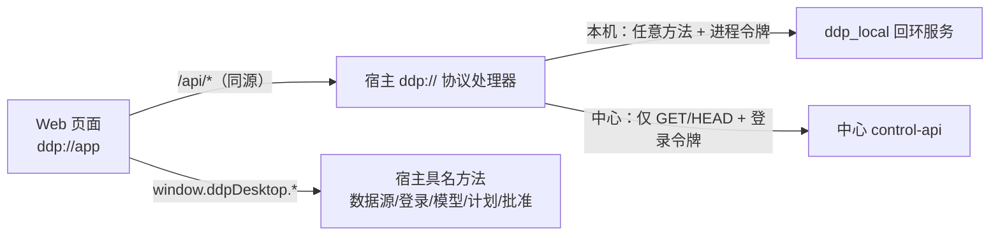

# 桌面端并入 Web AppShell：方案

更新时间：2026-10-01。状态：P1–P5 已实现并在真窗口走查（本机源 + B 栈中心源）；10-01 完成真实 App 文件计算整链演练。结果见 §6。
范围：用户 2026-09-25 重新开启桌面端（此前在 [SINGLE-CENTER-WEB-PLAN.md](SINGLE-CENTER-WEB-PLAN.md) §1 暂停）。联邦发现/委托/路由/递归仍暂停，只动桌面必须用到的联邦计划链路。
本文件是工作区 [plan.md](../../../plan.md) 的桌面专项细节；这里的 P1–P5 仅指 AppShell 改造，不代表总计划 P1–P5 或 M2/M3 已完成。后续范围与剩余顺序按总计划 §0／§17。

## 0. 已定的决定（用户，2026-09-25）

1. **桌面复用 Web 的整套 AppShell**：一套导航、一套术语、一套视觉（REV.04）。桌面只多出本机专有的几页。
2. **中心在桌面里是只读镜像**。v3「远端写一律走本机账本逐项批准的计划」（T25）不变：在中心上问答、上传、建 Wiki 仍然先建联邦任务，经原生对话框批准后派发。
3. **本机工作区 = 本地运行时实现中心接口的子集**：同路径、同形状。Web 页面一套代码跑在两种数据源上，本机没有的功能按能力隐藏。

要解决的六个问题（用户确认）：两套导航；同一件事起了好几个名字；内部概念直接摆给用户；向中心提问要绕路（本方案下仍然要走联邦任务，但入口就在问答框旁，不再是「切回本机 → 另一节 → 读说明」）；缺首运、设置、更新几页；视觉没按规范做。

## 1. 目标形态

### 1.1 数据源与请求路径

- 同一时刻只有一个**当前数据源**：一个本机工作区或一个已连接的中心。切换 = 宿主记下新的当前源 + 页面整体重载。页面内所有状态（store、缓存、草稿键）随之清空，不跨源串会话、串文件（v3 T65）。
- 页面像在浏览器里一样请求同源 `/api/...`，不知道令牌。宿主把 `/api/*` 转给当前源：
  - 本机：原样转发任意方法，附进程令牌；
  - 中心：只放行 GET/HEAD，附登录令牌；其余方法宿主直接回 `403 approved_plan_required`，不发出网络请求。
- 每个代理响应带 `X-DDP-Source: <sourceId>`；页面拦截器与自己启动时的当前源比对，不一致就丢弃（兜住切换瞬间在途的请求）。
- 中心返回的预签名对象地址（原件、裁图）由宿主改写为 `ddp://app/_object/<不透明编号>`，只允许该中心登记的源站，页面拿不到预签名 URL。
- 令牌只存在主进程（CredentialBroker），页面、日志、草稿里都没有（T21）。

### 1.2 导航

| 组 | 本机数据源 | 中心数据源（只读） | 浏览器 |
|---|---|---|---|
| 内容 | 资源库、文档库、检索、Wiki、联邦任务 | 同左（写操作禁用，见 1.5） | 资源库、文档库、抽取、检索、联邦任务、Wiki、图谱 |
| 账号 / 开发者 | — | —（管理中心请用浏览器） | 成员、API Key、用量、设置 |
| 本机 | 数据源、本地模型、设置、更新 | 同左 | — |

- 菜单仍由路由 meta 派生，新增 `features`（数据源能力）过滤：本机源的能力由本地运行时声明，中心源由宿主固定为只读子集。
- Web 侧边栏的「工作区」分组改名「内容」，把「工作区」一词留给本机工作区。
- 顶栏常显：当前数据源切换器 + 外发状态（v3 §3.2 硬要求）：本机「本机执行 · 原件不外发」；中心「只读 · 写入须建联邦任务并批准」。
- 没有任何数据源时（首次运行）落在「数据源」页。

### 1.3 统一术语

| 概念 | 统一叫法 | 废弃的叫法/做法 |
|---|---|---|
| 可跨版本追踪的资料 | 资源；其下是「第 N 版」 | 首屏展示的「固定版本 &lt;sha256&gt;」 |
| 本地运行时的后台工作（解析、建索引、生成 Wiki、装模型） | 不单列；在对象旁就地显示状态（资源的解析/索引状态、Wiki 构建状态、模型安装进度） | 桌面的「任务」一节（与联邦任务同名异义） |
| 跨节点的检索/回答/生成 | 联邦任务；「计划」「批准」「交付」是它的阶段 | 桌面的「远端计划」 |
| Wiki | 一个 Wiki 页；本机与中心只是数据源；联邦任务交付的 Wiki 在任务详情里用同一个阅读器打开 | LocalWikiPanel 与 WikiView 两套 |
| 中心 | 中心；接入叫「连接中心」（登录） | 「配对中心」与七字段表单 |
| 本机目录 | 本机工作区 | Web 侧边栏的「工作区」分组名 |

### 1.4 不再直接摆给用户的内部概念

- 工作区 UUID、版本摘要：移进详情的「技术信息」折叠区。
- 节点身份、工作区编号、用户编号：连接中心时宿主自动取（`/api/v1/federation/node?challenge=` 验签 → `/api/auth/login` → `/api/v1/client/handshake`），用户只填地址、账号、密码。对象存储源站默认与中心同源，「高级」里才可改。
- 幂等键、待对账编号：改为「结果未确认 · 重新核对」按钮，键只在「技术信息」里。
- 本机派发机的十几种状态：对外按契约的状态轴显示（与 Web 任务详情一致），明细收进详情。

### 1.5 中心只读时的写入口

中心源下所有写按钮都在（保持同一套页面），但禁用并写明原因；问答框、Wiki「构建」旁给出「作为联邦任务发起」，预填问题/题目，跳到本机源的联邦任务新建页。批准仍只认原生对话框（v3 §6.2，`client-host.mjs` 的 `confirmApproval`）。

### 1.6 桌面专有页（路由 meta `desktop: true`，浏览器里不注册）

- **数据源**（首运落点）：「打开本机工作区…」（原生目录框）、「连接中心…」（地址 + 账号 + 密码 + 是否保存登录；保存与否按凭证后端如实说明）。列表显示每个源的状态（可用 / 连接中 / 需要重新登录 / 不可用），可切换、断开、移除（移除不删本机资料，T65）。
- **本地模型**：EnvironmentWorkspaceView 的模型节迁入。
- **设置**：凭证存储方式与原因；退出行为（关窗即停本机任务，已受理的远端任务继续且可对账，v3 §3.3）；本地运行时后端；本机工作区目录。
- **更新**：当前版本；Linux 走软件包更新（Electron autoUpdater 不支持 Linux，v3 §3.6），给出命令与 `scripts/update_check.py` 的检查结果（若可调用），更新前提示检查进行中的任务。

### 1.7 视觉

桌面只加载 Web 页面，REV.04 自动生效。EnvironmentWorkspaceView、LocalWikiPanel、FederationPlanPanel 里自写的第二套 `--ddp-*` 样式随页面删除；新页面只用 `assets/ddp` 令牌与 Element Plus 覆盖层。

## 2. 契约（先改契约再实现）

1. **中心内容接口进 OpenAPI**：新建 `packages/contracts/openapi/content-v1.yaml`，写入 Web 实际调用、此前未进契约的资源、文档、会话问答（含 SSE 事件）、检索、证据接口的形状（以 corpus-api 现行实现为准）。中心与本机各有一条契约测试校验响应形状。
2. **本机子集声明**：`packages/contracts/ddp/local-content-subset.md` 列出本地运行时实现的 operation 与不实现的（返回 `404 not_supported_locally`），以及本机特有的差异（单一属主、无公开/组织、问答不跨轮继承时如何降级）。
3. **宿主代理与数据源**：`apps/desktop/HOST-CONTRACT.md` 增补 `/api` 代理规则、`X-DDP-Source`、`_object` 改写与新的具名方法（数据源列表/切换/移除、打开工作区、连接中心），`bridge.d.ts` 同步。
4. 新增的错误码与状态文案只进 `enums.yaml`，再跑生成器。

## 3. 阶段

| 阶段 | 内容 | 出口 |
|---|---|---|
| P1 契约与宿主代理 | content-v1.yaml、本机子集声明、宿主 `/api` 代理（本机源）、数据源具名方法；Web 桌面模式（无令牌会话、能力驱动导航、数据源切换器、外发状态、首运落点） | 桌面窗口里 AppShell 出现，本机源的资源库列出真实资源 |
| P2 本机内容接口 | ddp_local 实现子集：资源与版本、上传（同源直传）、文档（详情/版面/原件地址）、检索、证据、会话与问答 SSE、Wiki（含 `/api/wikis` 形状）、`/api/auth/me` 单一属主 | 桌面里在本机源上完成：上传 → 解析 → 检索 → 问答带引用并定位原文 → 建 Wiki → 追加版本 → 过期 → 重建 |
| P3 联邦任务与本机专有页 | 本机源的联邦任务列表/详情（新建、审阅、原生批准、派发、核对、交付），复用 PlanSummary/DeliveryPanel；本地模型、设置、更新、数据源页；删除 EnvironmentWorkspaceView、LocalWikiPanel、FederationPlanPanel 及其桥接残余 | 旧单页工作台在代码里不复存在；桌面没有第二套导航 |
| P4 中心只读 | 连接中心（宿主登录 + 握手取身份）、GET 代理、对象地址改写、写入口禁用与「作为联邦任务发起」 | 连接本机 B 栈的中心：浏览资源、看原文与引用、读 Wiki 与历史修订；任何写请求在宿主被拒且不出网 |
| P5 收口 | 桌面既有红项、联邦暂停范围的红项（提交前全绿是项目规定）、冒烟脚本更新、真窗口逐页走查截图、全量门禁、独立验收 | 提交 |

## 4. 验收

- 浏览器里的 Web 行为不变（Vitest、Playwright、A–E 的回归照跑）；只有「工作区」分组改名。
- 桌面：一套导航；首运落在数据源页；切换数据源后页面状态不串（另一源的会话、草稿、引用都看不到）。
- 本机源：P2 出口那条链在真窗口里走完，每一步截图。
- 中心源：只读浏览全通；每类写请求（POST/PUT/PATCH/DELETE）在宿主返回 `approved_plan_required`，记录代理确认零出网。
- 安全不变式保留并有测试：页面拿不到任何令牌（含 `_object`）；原生对话框是批准的唯一凭据；本机问答仍强制 `local_only`；无安全凭证后端时不落盘。
- 视觉按 DESIGN-GUIDE §7 自查十项。

## 5. 风险与已知取舍

- 中心 GET 代理用的是 Web 会话接口，不是 ddp-client/1 的 `client/query`。UI 不再用后者读中心；宿主里远端 `clientQuery` 路径随切换删除，中心侧 ddp-client/1 的服务端实现保留（仍是契约的一部分）。
- 中心登录令牌是 7 天 JWT，到期后该源变「需要重新登录」，不自动续期。
- 本机问答的输出以一次性事件发出（本地模型不逐字流），前端照常显示；不伪装成流式。
- `/api/*` 代理把中心的全部 GET 暴露给页面，相当于浏览器里的同一账号。中心侧授权照旧逐请求判定。

## 6. 实施结果（2026-09-26）

- **P1/P2**：`content-v1.yaml`（32 条端点）+ `local-content-subset.md` + 守卫 `check_content_contract.py`；ddp_local 的 `content_http.py` 按同路径同形状实现子集，schema 升 v3。宿主 `/api` 代理：本机源任意方法带进程令牌，但 `/api/v1/*` 私有路由除 `GET /api/v1/capabilities` 外一律 `not_supported_locally`（否则页面能直接 POST 计划批准，绕过原生对话框）。
- **P3**：旧单页工作台、`LocalWikiPanel`、`FederationPlanPanel` 与 `/workspaces` 路由已删；联邦任务改为 `/tasks`、`/tasks/new`、`/tasks/local/:planId`。渲染进程具名 IPC 收窄到本地模型管理（`clientCommand` 只剩 `models.install/start/stop`，`clientQuery` 只剩 `models.list`）；准备页锁定的本地输入改从本机源 `/api/resources` 读。
- **P4**：连接中心 = 节点挑战证明 → 登录 → 握手；JWT 只在宿主。走查中抓到并修掉三处：
  1. 开发构建允许 `http://127.0.0.1` 中心，但共享 `HttpProvider` 只认 https，源连上即「不可用」→ 宿主选项 `loopbackCenters`（仅未打包）；`localhost` 不再放行（与 provider 对齐）。
  2. `sourceActivate` 只重启连接循环就返回，页面会把瞬时的「不可用」当成切换失败 → 保持「连接中」直到快照为当前或连接放弃（20 s 上限）。
  3. 中心（Go）JSON 把 `&` 写成 `\u0026`，按原始文本改写会在 `\u0026` 处截断，**预签名查询串带着签名漏进页面**且原件打不开 → 改为解析 JSON 后逐字符串改写，改写后去掉上游 `Content-Length`。
  中心只读下另外禁用了会发写请求的入口（按钮禁用并写明原因，入口改「作为联邦任务发起」）：问答「发送」与新建/删除会话、「校验版本」、文档表的重解析/重建索引/删除与批量选择、授权副本「撤销」、证据人工核对、目录「封存当前可见目录」。独立验收抓到其中后四处起初漏门（宿主仍会 403，但界面不该让人点）。
- **P5**：本机源走查链（上传 → 解析 → 检索 → 问答带引用定位 → 建 Wiki → 追加版本 → 过期 `source_version_changed` → 在最新版上重建后不再过期）与中心源走查（浏览、检索、原件经 `_object` 从对象存储取回且页面拿不到存储地址、写请求 403 且零出网、「作为联邦任务发起」切回本机并预填）截图在 `.dev-logs/desktop-walk-20260926/shots/`（01–26 本机，30–37 中心）。
- **文件计算真机演练（2026-10-01，`065f115`）**：真实 App 经测试 CA 中继连 B 栈中心，跑通「本机固定版本 → 计划与原生批准 → 原件直传 → 中心真解析 → Range 取回 → 宿主独立重算 → 原子导入 → 确认」，中继在上游完成后断连制造丢回执。抓到并修掉六处整链断点：authorize 被 query 白名单拒（本机就拒、一字节未发）、账本拒绝被记成 transfer_unknown、`/delivery/result` 对文件交付 404、文件交付无 id/state 致确认永不可用、ack 发带前缀摘要被中心 400、确认回执丢失的提示被刷新清掉；另补 `transport_error` 文案。结果见 `docs/refactor/artifacts/desktop-file-compute-drill-20261001.json`。
- **仍未做 / 已知限制**：Linux 没有自动更新器（更新页给出 `update_check.py` 命令）；中心 JWT 到期只能重新连接；中心会话问答在桌面里不可用（按 T25 走联邦任务）。文件计划的版本下拉里，本地原件与交付导入副本同名同大小、无法区分（选到导入副本会 policy_denied）；新建联邦任务页出现过一直不消的「任务草稿保存失败」，原因未查；演练中 Electron 主进程有一次原生 SIGSEGV（内嵌 Node 的 TLS 写完成回调），未复现，持久状态未受损。
